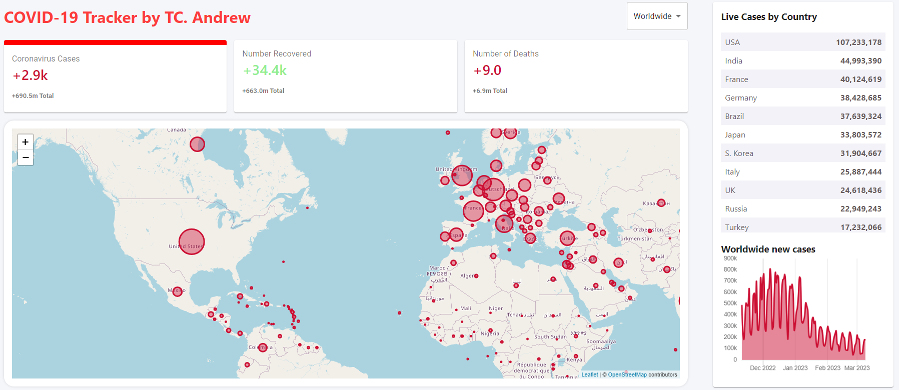

## COVID-19 Cases Tracker

### DEMO

- Check out my COVID19 cases tracker at:
  - [COVID19-Tracker](track-covid19-jastudio.netlify.app/)

### Overview

- The COVID-19 Cases Tracker is an application that provides real-time tracking and visualization of COVID-19 cases worldwide.
- It features an interactive map displaying red dots representing the number of cases in different countries.
- The size of the dots corresponds to the severity of the outbreak, with larger dots indicating higher case numbers.
- Additionally, the app presents comprehensive statistics in the form of tables and graphs on the right side of the interface.

### Features

- Real-time tracking of COVID-19 cases worldwide.
- Interactive map displaying red dots to represent cases in different countries.
- Dot size correlates with the severity of the outbreak.
- Detailed statistics presented in tables and graphs for in-depth analysis.
